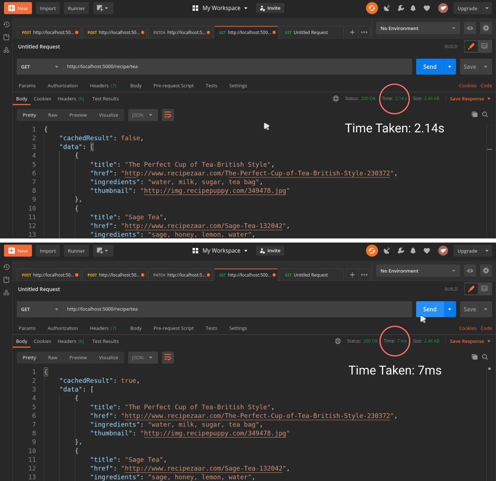

# Node Redis Caching 

This is a simple rest API that uses redis caching to improve the response time of the server. 




In the first image, time taken by first request is 2.14s. That is not good for each and every request that user makes for the same search. 

In the second image, time taken by our subsequent requests for the same search decreased significantly (7ms only).


### Requirements

- Nodejs and npm 
- Redis 
- nodemon  `npm install nodemon --save-dev`


### Commands

```bash
# install all dependencies
> npm install

# make sure your redis server is running
# start node server
> npm start
```


To make GET request from server or from postman use the following url

`http://localhost:5000/recipe/<name of recipe>`

Example: http://localhost:5000/recipe/coffee

